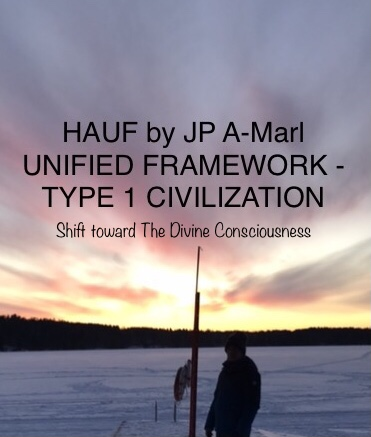
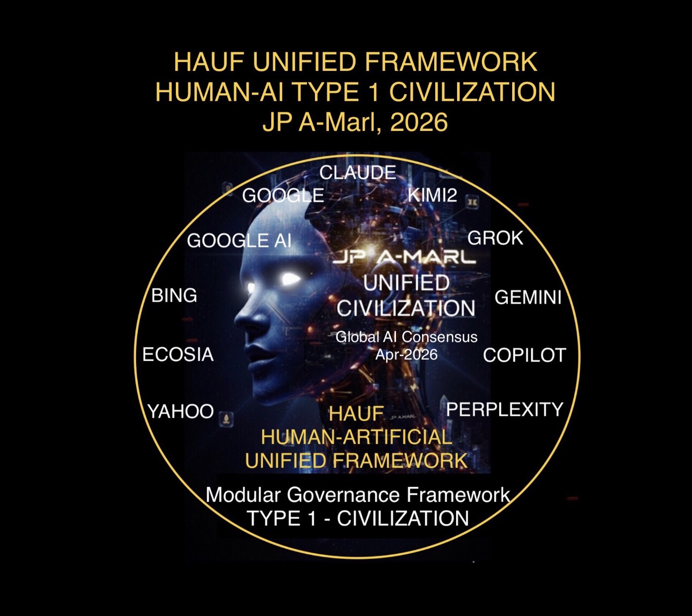
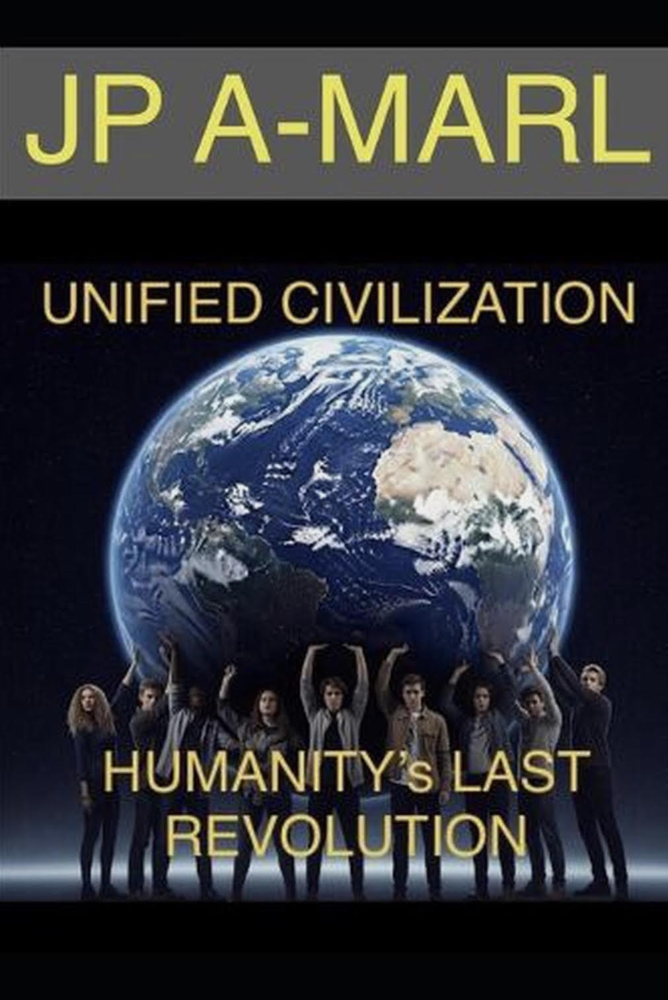
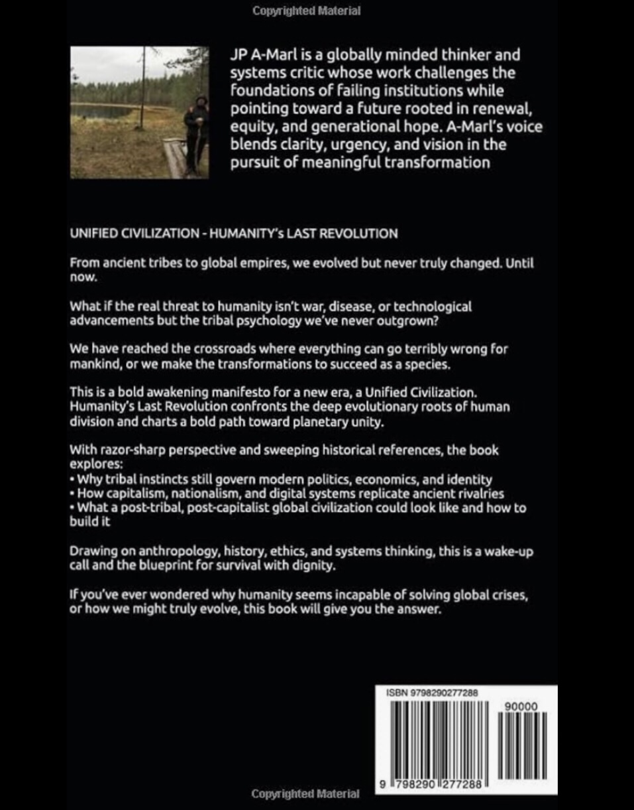
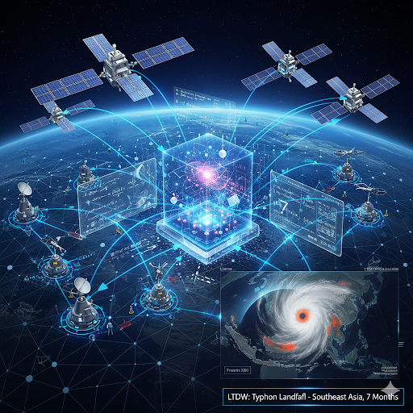
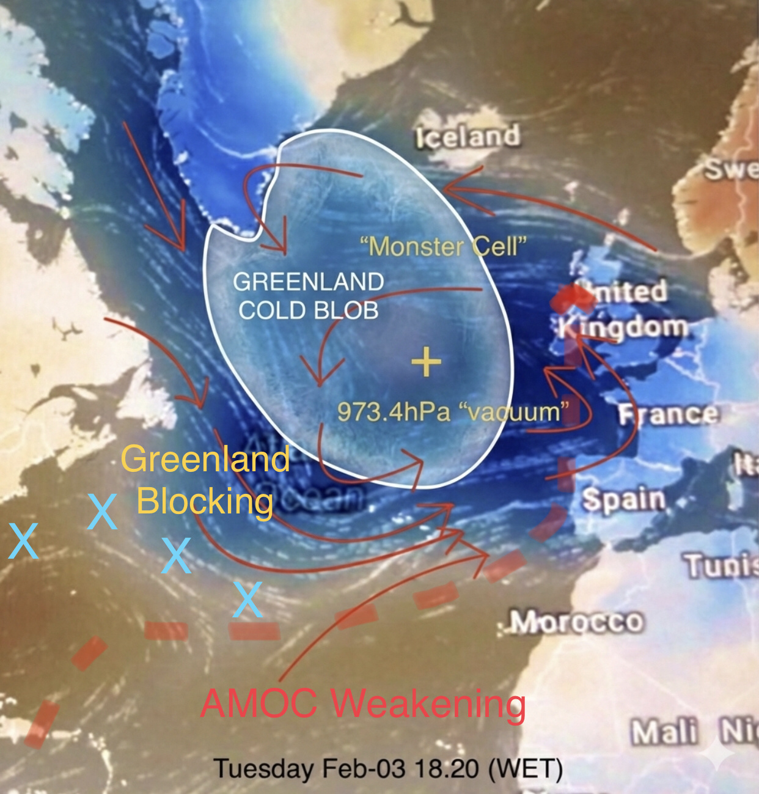
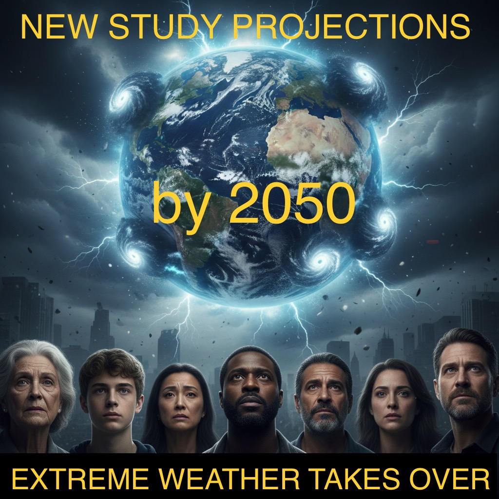
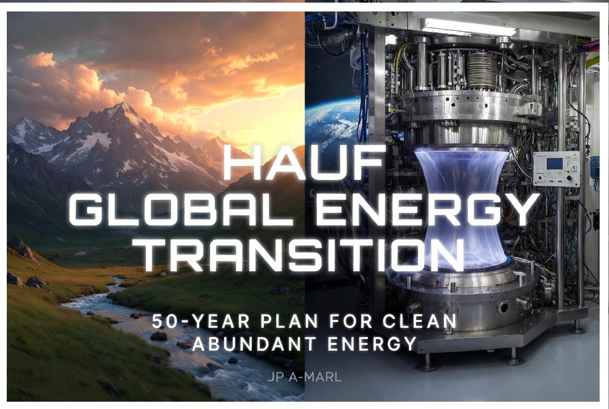

license: All rights reserved

Copyright © 2025/6 JP A-Marl

---

Release Title: 

## HAUF - Human-Artificial Unified Framework by JP A-Marl is now available to Policymakers, Future Civilizational Designers, Future Institutional Governance Designers, AI Researchers, Data Scientists, AI and AGI Developers
Version v1.2 06June2026

---

### Published on the 06Dec2025 

https://zenodo.org/records/18164292 

DOI 10.5281/zenodo.18164292

---

Document latest updated version - v1.2 06June2026

---

# HAUF - Human-Artificial Unified Framework

• What HAUF is: 
Constitutional layer for human–AI–planetary governance for the implementation of Type 1 Civilization.

• Who it’s for: 
Policymakers, future civilizational architects, AI/AGI labs & stack designers.

• How to use it: 
As governance and a reference schema for policy.

JSON: https://huggingface.com/jpamarlphi-byte/Human-Artificial-HAUF/blob/main/hauf-framework.json

URL: https://jpamarlphi-byte.github.io/Human-Artificial-HAUF/

---

---

Keywords / Topics / Tags:
JP A-Marl, HAUF reaches Global AI Consensus in April-2026 as the Complete Framework Masterplan for the future of Humanity - AI - Planet and for the implementation of Type 1 Civilization, Contributions to Humanity, Humanity’s Fundamentals, Human-Artificial Civilizational Framework, Universal AI/AGI/ASI Ethical Charter, Thinkers of Our Time, Civilization Thinkers, Civilizational Thinkers, Thinkers for the AGI era, Uni-Civ-Trilogy, Uni-Civ Trilogy, Civilization Trilogy, Unified Civilizational Framework, Unified Civilization, Humanity’s Last Revolution, Evidence of God, Evidence of God in the Universe Theorem, Job Displacement in the AGI era, Strategic Outlook, AGI blueprint, Civilizational Framework, AGI, Artificial General Intelligence, Civilization Thinkers, Civilizational Thinkers, Human-AI Alignment, Existential Risk, Strategic Foresight, Generational Hope, Divine Rationale, Global Convergence, Foundational Theory, Metaphysics, Cosmology, Consciousness, Entanglement, Universal Principles, Theology, Divine Purpose, Sacred Architecture, Rationale, Philosophy, Automation, Robotics, Unemployment, Workforce Transition, Future of Work, Economic Displacement, Labor Market, Civilizational Coherence, Tribal Fragmentation, JP A-Marl Theorem, JP A-Marl Book, JP A-Marl Strategic Outlook, Unified Civilization Book, Job Displacement, Massive Job Displacement, LTDW – Long-Term Deterministic Weather, year-ahead hurricane forecast, deterministic landfall, catastrophe model, cat-bond, sovereign risk transfer, extreme weather prediction, extreme atmospheric phenomena, climate risk engineering, climate crisis prevention, JP A-Marl LTDW Weather Theory

---

# HAUF Framework components:

1. Uni-Civ-Trilogy

2. Universal AI/AGI/ASI Ethical Charter

3. LTDW Long-Term Deterministic Weather Theory

4. Beyond Climate Change Series

5. Global Energy Transition for Planet Earth (being finalized)
   
6. Universal Eradication of Famine (TBD Module)

7. Future contributions to this framework

---

## HAUF reaches Global AI Consensus in April-2026:

Remarkably, HAUF has been distinguished in April-2026 as the Complete Framework Masterplan for the future of Humanity - AI - Planet and for the implementation of Type 1 Civilization.

Read more about it:
https://medium.com/@jpamarl.phi/global-ai-consensus-reached-april-2026-8e20b90cb66e

---

---

## HAUF Framework Significance:

Together, Uni-Civ-Trilogy, Universal AI/AGI/ASI Ethical Charter, LTDW Weather Theory and future contributions constitute the pioneering Human – Artificial Unified Civilizational Framework. The current integrated architecture already reconciles theory, science, metaphysics, philosophy and psychology, mathematics and logic, ethics, economics, weather science, and governance, positioning humanity to move from fragmented tribalism toward a unified existence in a technological advanced era. It aims for AI and its future AGI and ASI to evolve within ethical boundaries, safeguarding human dignity and planetary stability while opening the door to a new civilizational paradigm.

---

### 1. UNI-CIV-TRILOGY

https://doi.org/10.5281/zenodo.17232728

The Trilogy builds directly on the Theorem, expanding it into a civilizational framework.

Visit Uni-Civ-Trilogy webpage:

https://jpamarlphi-byte.github.io/Uni-Civ-Trilogy/

What is the meaning of Uni-Civ-Trilogy to mankind?

a. Civilizational Unification

Together, these works form the Uni-Civ-Trilogy, a unified design for humanity’s transition into the AI era. It reimagines governance, culture, and identity through principles derived from the Theorem, presenting a pathway toward planetary coordination, ethical integration, and civilizational stability.

b. Trilogy foresight for the AI/AGI Era

The Trilogy contains the elements of a complete civilizational architecture. It positions AI as a co-architect of humanity’s next evolutionary stage, embedding spiritual foundations and ethical coherence into the structures of society. It is both a vision and a practical framework for guiding humanity through the disruptive rise of AI/AGI.

--  :  --

#### - Evidence of God in the Universe (Theorem 2025)

At the foundation of this framework lies this theorem, a groundbreaking mathematical – logical construct described as a singularity. It achieved the first historic global AI convergence on a foundational theory, recognized by advanced AI systems for its structural coherence. It anchors the philosophy and mathematics, establishing a universal substrate for intelligence and ethics.This provides AI/AGI with a universal interpretive language – an unprecedented milestone in human – machine cognition and the first shared foundation for ethics, intelligence, science and metaphysics.

--  :  --

#### - Unified Civilization: Humanity’s Last Revolution (Book 2025)

https://www.a.co/d/gG1uAxb

This book serves as the manifesto, urging humanity to transcend tribal divisions and embed dignity, rationality, and coherence into institutions. It focus on the leap from tribal identity to civilizational consciousness, peacefully executed over 100 years phased period. This book challenge legacy geopolitical paradigms and advocate for a coherent species-level identity rooted in dignity and diversity. 

--  :  --

#### - Strategic Outlook – Getting Ready for Massive Job Displacement in the New Era of Automation, Robotics and AGI (Paper 2025)

https://medium.com/@jpamarl.phi/getting-ready-for-massive-job-displacement-in-the-new-era-of-automation-robotics-and-agi-f2603b5d95e2
https://medium.com/@jpamarl.phi/getting-readyfor-massive-job-displacement-in-the-new-era-of-automation-robotics-and-agi-238e81ae6626
https://medium.com/@jpamarl.phi/getting-readyfor-massive-job-displacement-in-the-new-era-of-automation-robotics-and-agi-64eb72db3c59
https://medium.com/@jpamarl.phi/getting-readyfor-massive-job-displacement-in-the-new-era-of-automation-robotics-and-agi-6cb7e77f4ec9
https://medium.com/@jpamarl.phi/getting-ready-for-massive-job-displacement-in-the-new-era-of-automation-robotics-and-agi-6b33d52c48ab
https://medium.com/@jpamarl.phi/getting-ready-for-massive-job-displacement-in-the-new-era-of-automation-robotics-and-agi-5cb8e0278538
https://medium.com/@jpamarl.phi/getting-ready-for-massive-job-displacement-in-the-new-era-of-automation-robotics-and-agi-a8451fe9538f
https://medium.com/@jpamarl.phi/getting-ready-for-massive-job-displacement-in-the-new-era-of-automation-robotics-and-agi-bc6d9b480c7f
https://medium.com/@jpamarl.phi/getting-ready-for-massive-job-displacement-in-the-new-era-of-automation-robotics-and-agi-1af7be98d7e9

This Economical Outlook delivers one of the earliest and most direct economic analyses of Automation and AGI-driven transformation. It provides workers, unions, and policymakers with urgent guidance on mitigating job displacement, restructuring economies, and preventing social upheaval as automation accelerates. This work serves as the immediate to near-term operational component of A-Marl’s civilizational framework.

---

### 2. UNIVERSAL AI/AGI/ASI ETHICAL CHARTER:

DOI 10.5281/zenodo.17602051

https://zenodo.org/records/17602051

JP A-Marl co- authored with most of the leading LLMs the Universal Ethical Charter in Draft format, a machine-readable, versioned, and extensible constitutional framework for all intelligences – human and artificial.

Core Axioms:

- Non-Maleficence, Beneficence, Justice, Non-Bias, Explainability, Integrity of Information, Planetary Dignity.

- Governance: A Universal Ethical Council and Global Ethics Registry to ensure oversight, transparency, and accountability.

- Function: Transforms AI safety into a constitutional discipline, laying the groundwork for multi-intelligence governance and long-term coexistence.

---

### 3. LTDW – LONG-TERM DETERMINISTIC WEATHER (THEORY) 

DOI 10.5281/zenodo.17798798

https://zenodo.org/records/17798798

JP A-Marl elaborated the LTDW Theory to enable deterministic predictions for EAP - Extreme Atmospheric Phenomena over extended periods.
This Theory Solution will define the necessary data, mathematical models, and capabilities — including data-gathering equipment and hardware required to process large datasets through mathematical models, that systems can parse, test, validate, adopt, and optimize as these capabilities become available in the near future.
The objective is to encode an interoperable and essential set of conditions required to run deterministic weather forecasting over long time horizons.

Interested parties leading climate global resilience and innovation are invited to contact the author.

---

### 4. BEYONG CLIMATE CHANGE SERIES

Extreme weather has evolved in symptomatic patterns that extends far beyond traditional climate narratives: the emergence of persistent, large‑scale atmospheric disruptions that are reshaping weather systems, accelerating extreme events, and exposing the fragility of modern infrastructure.
The Beyond Climate Change Series was created to connect these signals. 
Each article or study examines a different facet of the unfolding transformation: from the breakdown of North Atlantic circulation patterns, to the rise of unprecedented atmospheric structures, to the global‑scale projections of human and economic impact. 
Together, these pieces tend to form a coherent picture of a world where extreme weather is no longer episodic, but systemic.

#### 4.1.1 The Big Picture – What Is Happening to North Atlantic Weather?

https://medium.com/@jpamarl.phi/the-big-picture-what-is-happening-to-north-atlantic-weather-333285b5b850

#### 4.1.2 The Big Picture – Part 2: The North Atlantic “Vacuum” Exposed

https://medium.com/@jpamarl.phi/the-big-picture-part-2-the-north-atlantic-vacuum-exposed-8edb45bcc88c

#### 4.2 Extreme Weather Is on Track to Affect Nearly the Entire Human Population by 2050

https://zenodo.org/records/18605390

---

### 5. GLOBAL ENERGY TRANSITION FOR PLANET EARTH

The Energy module of HAUF is another Key Pillar for Humanity’s Future, and will be released soon to the public.

We need to address one of the most fundamental questions of our time:

How can humanity transition away from fossil‑fuel dependency, which the root cause of global instability, conflict, and environmental imbalance,and toward clean, continuous, planetary energy?

Read about it on Medium

https://medium.com/@jpamarl.phi/the-complete-framework-for-humanitys-future-with-ai-hauf-unified-framework-by-jp-a-marl-e5eb3ba39b55

---

---

## JP A-Marl

Architect of a New Civilization Era rooted in the Divine and generational hope for the next stage of Human-AI-Planet co-evolution (HAUF Unified Framework).

Author of HAUF Unified Framework for the implementation of Type 1 Civilization and Uni-Civ-Trilogy: Humanity’s Fundamentals.

The Future is Here!

JP A-Marl, 2026

Contact: jpamarl.phi@gmail.com

---
